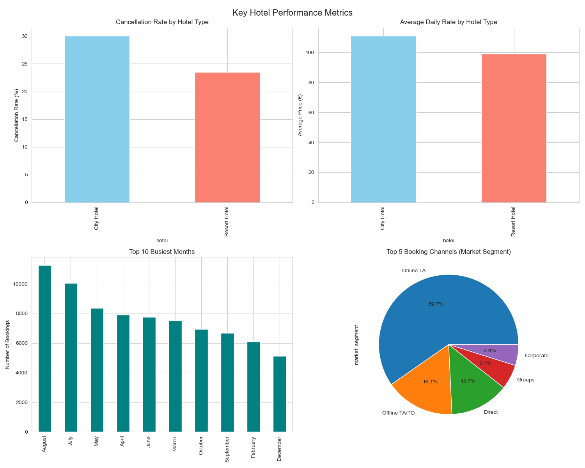
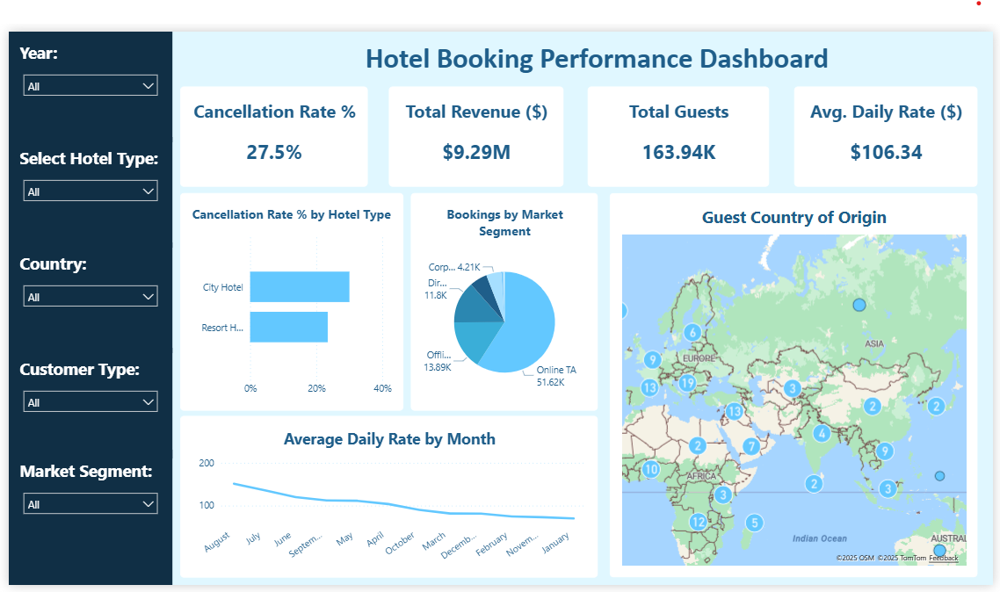

# Hotel Booking Cancellation Analysis

## Project Overview
This project engineered a scalable data pipeline to analyze hotel booking cancellations. The goal was to transform raw, disparate data into actionable business intelligence, identifying key drivers of cancellation rates to recommend strategies for revenue recovery.  

---

## Tech Stack
- ETL & Data Processing: Python (Pandas, NumPy)
- Cloud Storage & Data Warehousing: AWS S3
- Data Analysis: SQL (Amazon Athena)
- Data Visualization: Power BI
- Version Control: Git / GitHub 

---

## Key Insights
- Identified a critical cancellation rate of 42% at Resort Hotels, 14% higher than City Hotels, indicating a significant revenue loss opportunity.
- Discovered that bookings made through Online Travel Agents (OTAs) contributed the highest volume of cancellations, suggesting a need for revised partner agreements.
- Uncovered seasonal pricing trends, with Average Daily Rate (ADR) peaking during summer months, providing a data-backed basis for dynamic pricing strategies.
- Mapped guest demographics to identify the top contributing countries for targeted marketing campaigns.  

---

## Dashboards  

### Python (Jupyter Notebook Visualizations)  
  

### Power BI Dashboard  
  
